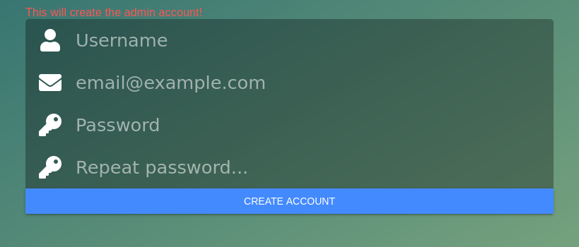
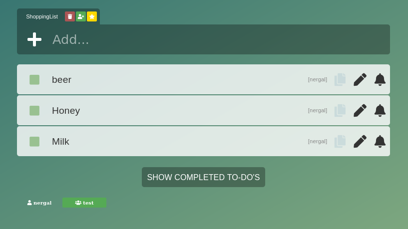

# DoIT Todo List

This is a simple todo-list made with Vue(frontend) and a simple webserver written in Go(backend). 


Note that this started out as a simple hack and the source code probably requires some polishing. Use at your own risk.

The vue part was based and inspired by https://github.com/webnoobcodes/vuejs-todoapp.

## Features

* Multi-user support
* Share lists with other users
* Add reminders for items (sent via mail)
* Add notes to items 
* Complete and item but still be able to view it.
* Sort items (optimises the shopping for shopping lists!)
* Delete items 
* Multiple lists 
* Favorite list (that shows first when accessing)
* Phone support (Using PWA features)
* Desktop support (webpage)
* Update "live" when someone else adds stuff.
* TLS support
* SQLite database (easy to backup)
* Self-hosted
* Simple admin interface
    - Validate new users
    - Remove access tokens
    - Remove users 

## Usage & Requirements
* In order to send email reminders you need to use a mailserver. I use postfix locally.
* You need to run DoIt with TLS if you want to be able to use phone app.
* First access will allow for admin creation!

```
./doit -tlscert server.crt -tlskey server.key -mailhost localhost:25 -database my.db
```
## Development

Development environment (requires TLS certificates, se makefile):
```
make dev
```

## Todo

* Add support for push notification
* Throttle signup/login requests better.
* Code cleanup for both backend and frontend.
* Packaging

## Screenshots





